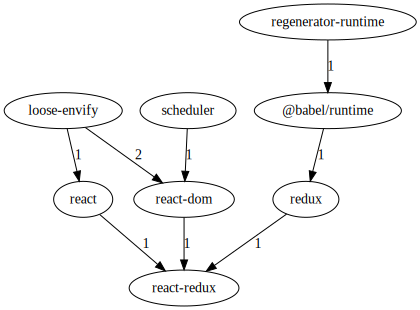
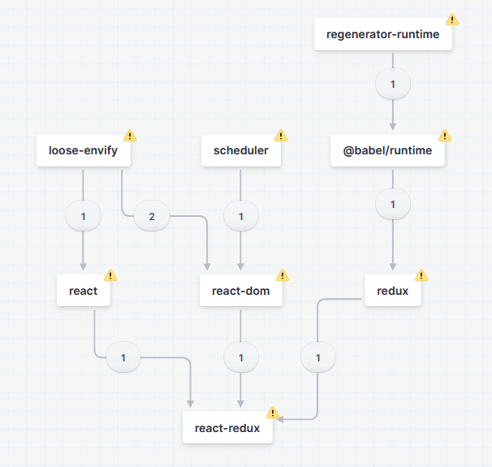

# Visualizing graph data in TypeScript

This repo explores different ways of different of visualizing graph data in TypeScript.

Graphs are of the vertex-edge variety (aka node-link), not the bar graph/line graph kind used for charting.

The example output shown below is all generated from code samples found within this repo (with extra steps for XState noted).

## GraphViz

GraphViz is a graph visualization program written in C.  The node-graphviz package makes a WASM build of this available from TypeScript.  This puts very useful functionality at our fingertips, but would be painful to modify.

The graphviz package provides a corresponding interface for constructing graphs.  It has types (@types/graphviz), but note the attributes are just typed to key-value pairs, which means if you mistype an attribute you will get run-time errors where compile-time would be preferable.

The link labels just hang in space.  In a complex graph this is both ugly and hard to identify which text corresponds to which link.

Example output:

## XState

xstate is a well known package for doing state machines on a JavaScript platform, typically used with React.  A state machine is slightly more than a directed graph, but a lot of the tooling is the same.  It is written in TypeScript.

The big disadvantage with XState is that its visualizer is not available in an npm package, only from a website https://stately.ai/registry/new?source=landing-page

It's an excellent visualizer with interactive editor, and you can paste code into it, such as the example given in this repo.  The output is good, the link labels are good.  It does try to warn us that our example directed graph doesn't quite work as a state machine.

Example output:

## Further examples wanted

If I've missed any good ways of visualizing graph data in TypeScript, please open an issue or PR and let me know.  Packages containing useful data-types and algorithms for working with graph data would also be of interest.
